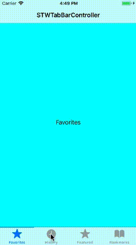

# STWTabBarController

[](https://developer.apple.com/iphone/index.action)
[](https://developer.apple.com/swift)
[](http://mit-license.org)

STWTabBarController is an UITabBarController subclass in order to have a sliding TabBarController with item indicator.

<kbd>

</kbd>

## Installation

**CocoaPods:**

```
pod 'STWTabBarController'
```

## Usage

use it like a regular UITabBarcontroller

## Customize

You can customize in `STWTabBarController`

* **`sliderColor`** slider color.

  ```swift
  var sliderColor: UIColor { get set }
  // default: UITabBar.tintColor
  ```
  
* **`showIndicator `** indicator visible.

  ```swift
  var showIndicator: Bool { get set }
  // default: true
  ```

* **`sliderHeight `** slider height.

  ```swift
  var sliderHeight: CGFloat { get set }
  // default: 2
  ```

## Requirements

This pod requires a deployment target of iOS 9.0 or greater

## Author

[@Steewitter](https://twitter.com/Steewitter), [me@steewe.com](mailto:me@steewe.com)

## License

STWTabBarController is available under the MIT license. See the LICENSE file for more info.